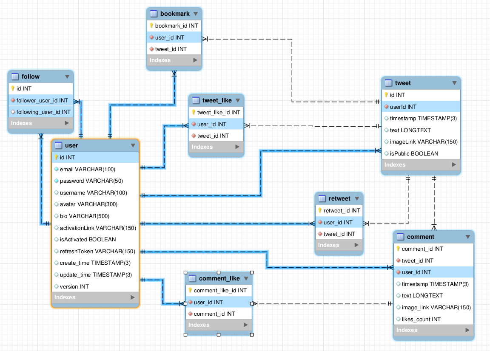

# Technical Design

## Database

[DB Model](./db_model.mwb)



## API

[Postman collection](https://www.postman.com/joint-operations-administrator-8259820/workspace/aqua-playground/collection/21698543-6e5c0f9a-a3e5-4823-97a8-d14129f35d2f?action=share&creator=21698543)

## Backend

### File structure

```txt
src
└─middlewares
| └─auth.middleware.js
| └─error-logger.middleware.js
| └─request-logger.middleware.js
| └─upload.middleware.js
|
└─exceptions
| └─index.js
└─logger
| └─index.js
|
└─modules
| └─user
| | └─dto
| | | └─create-user.dto.js
| | | └─user.dto.js
| | └─user.controller.js
| | └─user.service.js   
| | 
| └─token
| | └─token.service.js
| |
| └─prisma
| | └─prisma.service.js
| |
| └─mailer
| | └─mail.service.js
| |
| └─explore
| | └─explore.controller.js
| | └─explore.service.js
| |
| └─follow
| | └─follow.controller.js
| | └─follow.service.js
| |
| └─tweet
| | └─tweet.controller.js
| | └─tweet.service.js
| |
| └─comment
| | └─comment.controller.js
| | └─comment.service.js
| |
| └─bookmark
| | └─bookmark.controller.js
| | └─bookmark.service.js
|
└─router
| └─index.js
|
└─constants.js
└─helpers.js
└─index.js
```

### Types

- ResponseUser: { id: number; username: string; email: string; bio: string: avatar: string, isActivated: boolean };
- getByIdResponseUser: { ...ResponseUser, _count: { followers: number; following: number }, amIFollowing: boolean }
- TokensPair: { accessToken: string; refreshToken: string };
- Payload: { id: number; email: string, isActivated: boolean };
- Retweet: { id: number; userId: number; tweetId: number };
- TweetLike: { id: number; userId: number; tweetId: number };
- Bookmark: { id: number; userId: number; tweetId: number };
- Follow: { id: number; followerUserId: number; followingUserId: number };
- Tweet: { id: number; userId: number; timestamp: DateTime; text?: string; imageLink?: string; isPublic: boolean, retweets: Retweet[]; tweetLikes: TweetLike[]; bookmarks: Bookmark[]; User: { avatar: string | null; username: string }; _count: { retweets: number; tweetLikes: number; bookmarks: number; comments: number} };
- Profile: { id: number; username: string; avatar: string; bio: string, followers: number; amIFollowing: boolean }
- TweetReaction: { retweet: boolean; like: boolean; save: boolean };
- Comment: { id: number; userId: number: tweetId: number; text?: string; image?: string, likesCount: number }
- CommentLike: { id: number; commentId: number; userId: number }

### Classes

### User classes

CreateUserDto

- username: string;
- email: string;
- password: string;

UpdateUserInfoDto

- username: string;
- email: string;
- bio: string;

UserDto

- id: number;
- username: string;
- email: string;
- bio: string;
- avatar: string;
- isActivated: boolean;

UpdatePasswordDto

- id: number;
- oldPassword: string;
- newPassword: string;

UserEntity

- id: number;
- username: string;
- email: string;
- password: string;
- bio: string;
- avatar: string;
- isActivated: boolean;
- activationLink: string;
- refreshToken: string;
- createdAt: Date;
- updatedAt: Date;

UserController

- signUp(req, res, next)
- signIn(req, res, next)
- logOut(req, res, next)
- activate(req, res, next)
- refresh(req, res, next)
- getById(req, res, next)
- updateInfo(req, res, next)
- updateAvatar(req, res, next)
- removeAvatar(req, res, next)
- updatePassword(req, res, next)
- delete(req, res, next)

UserService

- signUp(user: CreateUserDto): { tokens: TokensPair; user: ResponseUser }
- signIn({ email: string, password: string } ): { tokens: TokensPair; user: ResponseUser }
- logOut(email: string): string
- activate(activationLink: string): void
- refresh(token: string): { tokens: TokensPair; user: ResponseUser }
- getById(id: number, loggedUserId: number): getByIdResponseUser
- updateInfo(data: UpdateUserInfoDto, id: number): ResponseUser
- updateAvatar(id: number, avatarData: File): ResponseUser
- removeAvatar(id: number): ResponseUser
- updatePassword(data: UpdatePasswordDto): void
- delete(id: number): void

### Token classes

TokenService

- generateTokens(payload: Payload): TokensPair;
- validateToken(token: string, type: 'access' | 'refresh'): Payload | null;
- validateAccessToken(token: string): Payload | null;
- validateRefreshToken(token: string): Payload | null;

### Mailer classes

MailerService

- sendActivationMail(to: string, name: string, link: string): void;

### Explore classes

ExploreController

- getbyQueryAndFilter(req, res, next)

ExploreService

- getData(loggedUserId: number, query: string, filter: string): Tweet[] | Profile[]

### Follow classes

FollowEntity

- id: number;
- followingUserId: number;
- followerUserId: number;

FollowController

- getAllFollowers(req, res, next)
- getAllFollowing(req, res, next)
- following(req, res, next)

FollowService

- getAllFollowers(userId: number, loggedUserId: number): { username: string; data: Profile[]; }
- getAllFollowing(userId: number, loggedUserId: number): { username: string; data: Profile[]; }
- handleFollow(followerUserId, followingUserId, type: follow | unfollow): Follow | null;
- follow(followerUserId, followingUserId): Follow;
- unfollow(followerUserId, followingUserId): void;

### Tweet classes

CreateTweetDto

- userId: number;
- text?: string;
- imageData?: File;
- isPublic: boolean;

TweetEntity

- id: number;
- userId: number;
- timestamp: Date;
- text: string | null;
- imageLink: string | null;
- isPublic: boolean;

TweetLikeEntity

- id: number;
- userId: number;
- tweetId: number;

RetweetEntity

- id: number;
- userId: number;
- tweetId: number;

TweetController

- getAllFollowingTweets(req, res, next)
- getAllByUserId(req, res, next)
- getAllWithRepliesByUserId(req, res, next)
- getAllWithMediaByUserId(req, res, next)
- getAllWithLikesByUserId(req, res, next)
- getAllFollowing(req, res, next)
- create(req, res, next)
- react(req, res, next)
- delete(req, res, next)

TweetService

- getAllByUserId(userId: number, loggedUserId: number): Tweet[];
- getAllWithLikesByUserId(userId: number, loggedUserId: number): Tweet[];
- getAllWithMediaByUserId(userId: number, loggedUserId: number): Tweet[];
- getAllWithRepliesByUserId(userId: number, loggedUserId: number): Tweet[];
- getAllFollowingTweets(userId: number): Tweet[];
- create({ text?: string, isPublic: boolean }, userId: number, imageData: File): Tweet;
- react(userId: number, tweetId: number, reaction: TweetReaction): void;
- handleRetweet(userId: number; tweetId: number, reaction: boolean): void;
- handleLike(userId: number; tweetId: number, reaction: boolean): void;
- handleSave(userId: number; tweetId: number, reaction: boolean): void;
- delete(userId: number, tweetId: number): void;

### Comment classes

CreateCommentDto

- tweetId: number;
- userId: number;
- text?: string;
- imageData?: File;

CommentEntity

- id: number;
- tweetId: number;
- userId: number;
- text: string | null;
- imageLink: string | null;
- likesCount: number;

CommentLikeEntity

- id: number;
- userId: number;
- commentId: number;

CommentController

- getAll(req, res, next)
- create(req, res, next)
- like(req, res, next)
- delete(req, res, next)

CommentService

- getAll(tweetId: number, userId: number): Comment[];
- create(data: CreateCommentDto): Comment;
- like(userId: number, commentId: number, like: "true" | "false"): CommentLike | null;
- delete(userId: number, commentId: number): void;

### Bookmark classes

BookmarkEntity

- id: number;
- userId: number;
- tweetId: number;

BookmarkController

- getAllTweets(req, res, next)
- getTweetsWithLikes(req, res, next)
- getTweetsWithMedia(req, res, next)
- getTweetsWithReplies(req, res, next)

BookmarkService

- getAllTweets(userId: number): Tweet[];
- getTweetsWithLikes(userId: number): Tweet[];
- getTweetsWithMedia(userId: number): Tweet[];
- getTweetsWithReplies(userId: number): Tweet[];

### Routes

#### User endpoints

- `POST - /user/signup - UserController.signUp`
- `POST - /user/signin - UserController.signIn`
- `POST - /user/logout - UserController.logOut`
- `GET - /user/activate/:link - UserController.activate`
- `GET - /user/refresh - UserController.refresh`
- `GET - /user/:id - UserController.getById`
- `PATCH - /user - UserController.updateInfo`
- `PATCH - /user/avatar - UserController.updateAvatar`
- `PATCH - /user/password - UserController.updatePassword`
- `PATCH - /user/remove-avatar - UserController.removeAvatar`
- `DELETE - /user - UserController.delete`

#### Tweet endpoints

- `POST - /tweets - TweetController.create`
- `DELETE - /tweets/:tweetId - TweetController.delete`
- `PUT - /tweets/react/:tweetId - TweetController.react`
- `GET - /tweets/:userId - TweetController.getAllByUserId`
- `GET - /tweets/likes/:userId - TweetController.getAllWithLikesByUserId`
- `GET - /tweets/media/:userId - TweetController.getAllWithMediaByUserId`
- `GET - /tweets/with_replies/:userId - TweetController.getAllWithRepliesByUserId`
- `GET - /following-tweets - TweetController.getAllFollowingTweets`

#### Comments endpoints

- `GET - /comment/:tweetId - CommentController.getAll`
- `POST - /comment/:tweetId - CommentController.create`
- `PUT - /comment/:commentId - CommentController.like`
- `DELETE - /comment/:commentId - CommentController.delete`

#### Follow endpoints

- `GET - /followers/:userId - FollowController.getAllFollowers`
- `GET - /following/:userId - FollowController.getAllFollowing`
- `PUT - /follow/:userId - FollowController.follow`

#### Explore endpoints

- `GET - /search - ExploreController.getbyQueryAndFilter`
- `GET - /search/:query - ExploreController.getbyQueryAndFilter`

#### Bookmark endpoints

- `GET - '/bookmark - BookmarkController.getAllTweets`
- `GET - '/bookmark/with_replies - BookmarkController.getTweetsWithReplies`
- `GET - '/bookmark/media - BookmarkController.getTweetsWithMedia`
- `GET - '/bookmark/likes - BookmarkController.getTweetsWithLikes`

### Logger

Should log events(error, info, warn) and save logs into files on the server.

## Frontend

### UI

[Figma](https://www.figma.com/file/SVHcZ64Jzqppe9ORRHnpig/Twitler?node-id=0%3A1)

### Files structure

```txt
public
└─index.html
|
src
└─pages
| └─SignIn
| └─SignUp
| └─Home
| └─Explore
| └─Bookmarks
| └─Profile
| └─Settings
|
└─components
| └─ErrorBoundary
| └─AuthForm
| └─FollowModal
| └─Header
| | └─HeaderNav
| | └─UserMenu
| └─People
| └─ProfileCard
| └─ProtectedRoutes
| └─SettingsCard
| └─SubNav
| └─Tweet
| | └─TweetHeader
| | └─TweetText
| | └─TweetMedia
| | └─TweetButtons
| | | └─CommentButton
| | | └─ReactionButton
| | └─TweetCounters
| | └─TweetComments
| | | └─CommentForm
| | | └─Comment
| └─TweetForm
| └─Tweets
| └─TweetsContainer
| └─UpdateAvatar
| └─UpdateInfo
| └─UpdatePassword
| └─ViewInfo
|
└─elements
| └─FollowButton
| └─Logo
| └─LogoutButton
| └─RadioButton
| └─UploadImg
| └─UserCard
|
└─hooks
|
└─redux
| └─hooks
| └─store
|
└─index.tsx
└─index.scss
└─constants.ts
└─types.ts
└─helpers.ts

```

### Features

#### _Authentication_

Should implement user authentication, registration and protected routes, all unauthenticated users should be redirected to signin page. All routes except signin/signup and unknown should be protected.

#### _Header_

Should implement an app header which would be shown on all private pages.  
**Should contain:**

- an app logo
- main navigation with links to `Home page`, `Explore page` and `Bookmarks page`
- user menu with links to `Profile page`, `Settings page` and `Logout button`

#### _Tweet components and Home page_

Should implement `Home page` which should show all following and user's tweets in descending order from newest to oldest.  
Should contain form to create new tweet with ability to add text and image.  
Tweet should show author and timestamp, text and/or image, counters(comments, retweets, likes, saved), reaction buttons(comment, retweet, like, save), list of comments if any, form to add new comment.
Comment should show author and timestamp, text and/or image, likes counter, like button

#### _Profile_

Should implement `Profile page` which should show:  

- user card:
  - user name
  - avatar
  - following counter
  - followers counter
  - bio
  - follow button(visible only on other users profile)
- tweets in 4 categories:  
  - tweets - user's tweets and retweets
  - tweets & replies - all tweets with user's comments in it
  - media - user's tweets containing images
  - likes - all tweets with user's likes on it

Should make Tweet and Comment author clickable with link to it's profile

#### _Followers_

Should implement follow logic on user card and on `Follow modal` which would show list of followers/following. Each user in those lists will contain:  

- username
- avatar
- bio
- followers counter
- follow button(visible only on other users)

#### _Explore_

Should implement `Explore page` which should show all tweets in the app and search bar.  
Search bar should include 4 categories:

- top - tweets containing search query in the text in descending order by likes count
- lates - tweets containing search query in the text in descending order by creation date
- media - tweets containing image and search query in the text in descending order by creation date
- people - list of people containing search query in the user name. Each user card should contain username, followers count, bio, follow button(visible only on other users profile)

#### _Bookmarks_

Should implement `Bookmarks page` which should show all tweets that were saved in descending order by date.

#### _Settings_

Should implement `Settings page` which should contain 4 sub pages:  

- view user - show user info & `delete` user button
- update avatar - either upload new avatar image, or remove current one
- update info - form to update username, email and bio
- update password - form to update password

*_Each feature may add some changes into other feature in cases of components/elements extractions/refactoring_  
**_Overall the app should be a shallow and simplified copy of the [Twitter](https://twitter.com/)_
